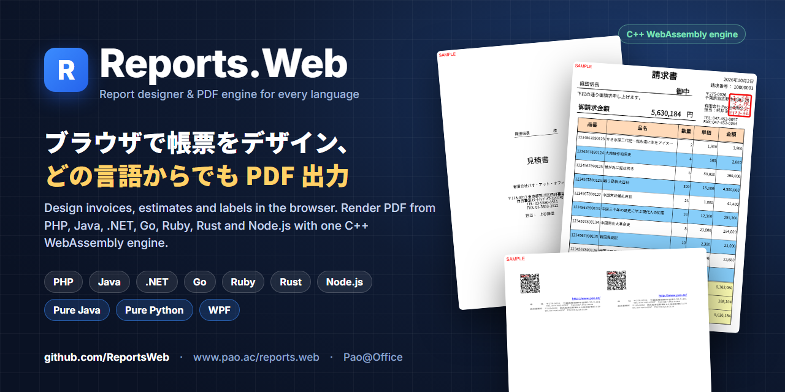
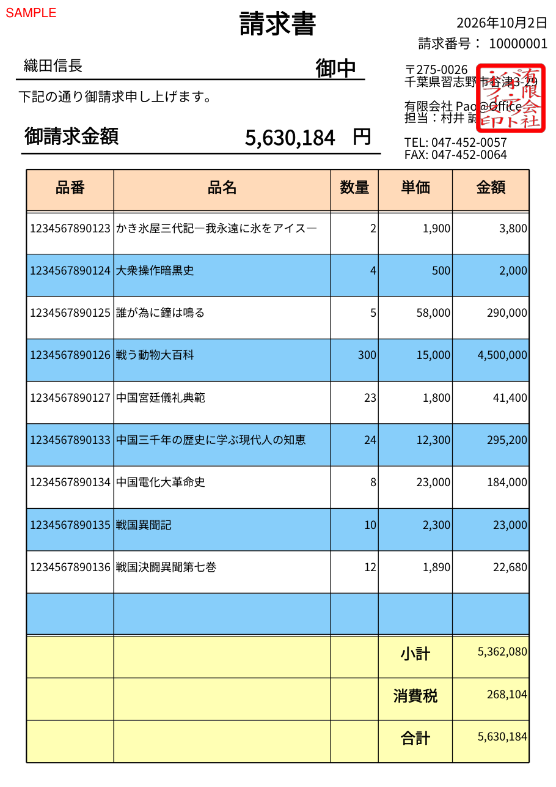

<p align="center"></p>

## Reports.Web — ブラウザで帳票をデザイン、どの言語からでも PDF 出力

**Reports.Web** は、純国産の帳票ツールです。帳票のレイアウトはブラウザで動くデザイナーで作り、アプリからは値を入れて印刷データを作るだけ。描画は C++ WebAssembly の帳票エンジンが行うので、**どの言語から出しても同じ帳票**になります。請求書・見積書・納品書・宛名ラベル・名刺・郵便番号一覧など、日本の業務帳票に向いています。

- 製品サイト：https://www.pao.ac/reports.web/
- オンラインデモ：https://www.pao.ac/reports.web/demo.html
- 価格：開発用パソコン 1 台につき 1 ライセンス（運用環境はランタイムライセンスフリー）

| デザイナー（ブラウザ） | 出力した請求書 |
|---|---|
|  |  |

### サンプルとパッケージ

各リポジトリは、製品の配布 ZIP に入っているサンプルです。Docker だけで、すぐに動かせます。

| 言語 | サンプル | パッケージ | 状態 |
|---|---|---|---|
| Node.js / TypeScript | [wasm-node](https://github.com/ReportsWeb/wasm-node) | npm [`@pao-at-office/reports-web`](https://www.npmjs.com/package/@pao-at-office/reports-web) | 公開中 |
| PHP | [wasm-php](https://github.com/ReportsWeb/wasm-php) | Composer `paoatoffice/reports-web`（Packagist 登録待ち） | 公開中 |
| Java | wasm-java | Maven Central | 準備中 |
| .NET (C#) | [wasm-dotnet](https://github.com/ReportsWeb/wasm-dotnet) | NuGet [`Reports.Web`](https://www.nuget.org/packages/Reports.Web) | 公開中 |
| Go | [wasm-go](https://github.com/ReportsWeb/wasm-go) | Go module [`github.com/ReportsWeb/wasm-go/reportsweb`](https://pkg.go.dev/github.com/ReportsWeb/wasm-go/reportsweb) | 公開中 |
| Ruby | wasm-ruby | RubyGems | 準備中 |
| Rust | wasm-rust | crates.io | 準備中 |
| Pure Java | java | Maven Central | 準備中 |
| Pure Python | — | 製品の配布 ZIP（SDK 同梱） | ZIP で提供 |
| WPF (.NET) | wpf | NuGet | 準備中 |

帳票エンジン：[`ghcr.io/reportsweb/engine`](https://github.com/ReportsWeb/engine)（Docker イメージ）

### しくみ

```
あなたのアプリ（PHP / Java / .NET / Go / Ruby / Rust / Node.js）
      │  帳票定義 .prepdj に値を入れて、印刷データ（PREPEJ / JSON）を作る
      ▼
帳票エンジン ghcr.io/reportsweb/engine（C++ WebAssembly）──▶ PDF
```

Pure Java・Pure Python・WPF 版は、エンジンを各言語の中で動かし、デスクトップのデザイナー・プレビュー・印刷まで含みます。帳票定義と印刷データの形式は全版共通です。

### 体験版

パッケージとエンジンは体験版で、出力に赤い「SAMPLE」の印が付きます。ご購入後に納品するライセンスファイルで印が消えます。→ [ご購入・お見積もり](https://www.pao.ac/reports.web/buy.html)

---

**English** — Reports.Web is a report designer and PDF engine from Japan. Design invoices, estimates, labels and business cards in the browser; build print data (PREPEJ JSON) from PHP, Java, .NET, Go, Ruby, Rust or Node.js; render identical PDFs with one C++ WebAssembly engine (`ghcr.io/reportsweb/engine`). Pure Java, Pure Python and WPF editions run the engine natively with desktop designer and previewer. Packages and the engine are trial builds (red "SAMPLE" mark) until a purchased license file is configured.

Pao@Office — https://www.pao.ac/ — info@pao.ac
